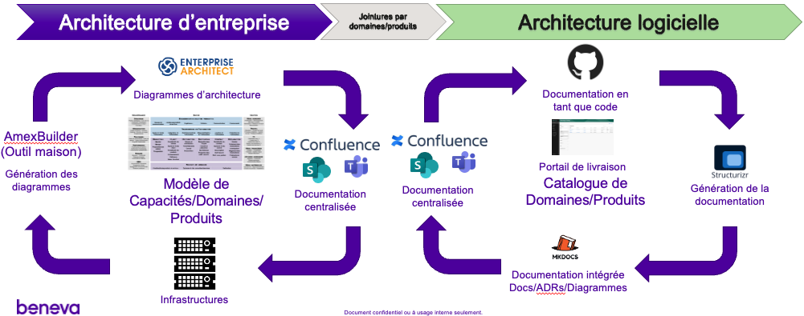

# Modélisation en tant que code - C4-Structurizr

Date: 2023-05-02

## Status

Proposed

## Contexte

### Rappel

- L’outil de modélisation officiel à l’architecture d’entreprise est **Enterprise Architect** basé sur le formalisme **Archimate**.

- Le architectes logiciels utilisent quant à eux beaucoup plus l’outil **draw.io**, équivalent en logiciel libre de Visio, pour la **modélisation de leurs architectures logicielles**.

- **Confluence** est utilisée pour la rédaction et la diffusion de la **documentation d’architecture**.

- Le **processus de gestion des orientations logicielles** a été confirmé & livré.

- La **TGL** assure la coordination des **orientations logicielles** et leur diffusion.

- La **nouvelle plateforme infonuagique de Beneva est maintenant disponible** pour les secteurs d’affaires.

- Arrimage avec le **nouveau cadre de responsabilités Agiles amenées par Symphony**.  Nouvelles responsabilités en lien avec l’**autonomie des équipes produits**.

- Le processus d’**industrialisation** favorise l’**automatisation** du processus de livraison des produits.  Il est préconisé d’**automatiser au maximum la génération des la documentation d’architecture**.

### Les problématiques à résoudre

- En dehors de l’architecture d’entreprise, **les pratiques de modélisation sont peu répandues**.  
- L’utilisation d’**Enterprise Architect et du formalisme Archimate sont peu maîtrisés par les architectes logiciels** et encore moins par les développeurs.
- La modélisation et la documentation d’architecture chez Beneva est un **processus grandement manuel**, peu d’automatisation.
- Le architectes logiciels utilisent en majorités l’outil draw.io, cet outil encadre peu la modélisation, implique un **problème d’uniformité**.
- La documentation d’architecture hébergée dans Confluence est peu uniforme et **n’est pas structurée par produit**.
- **Plusieurs supports de documentation utilisés** : Confluence, SharePoint et les canaux Teams.

L'industrialisation implique l'automatisation maximale du processus de livraison.  La documentation et la modélisation des architectures font partie de cette portée.

### Solution proposée – Industrialisation de la documentation d’architecture logicielle & de la  modélisation

- **Génération d’une partie de la documentation et des diagrammes d’architecture** à partir des gabarits produits hébergés dans le portail de livraison.
- Conservation de la **documentation au sein des dépôts d’artéfacts Git par produit**.
- Mise en œuvre de la technologie de **documentation en tant que code** « Markdown » et de l’outil Mkdoc pour la construction de la documentation.
- **Utilisation du formalisme C4** et de l’outil « Structurizr » en diagramme en tant que code pour la construction des modèles inclus dans la documentation.
- Hébergement de la **documentation dans le portail de livraison découpée par produit**.
- Mise en place d'une instance de ***Structurizr dans AWS pour le travail collaboratif***.

### Schéma Domaine Expérience développeur

<iframe id="myEmbeddedDiagram" src="http://localhost:8088/embed/6?diagram=ExperienceDeveloppeur&diagramSelector=false&iframe=myEmbeddedDiagram" width="100%" marginwidth="0" marginheight="0" frameborder="0" scrolling="no" allowfullscreen="true"></iframe>

### Schéma technologique

<iframe id="myEmbeddedDiagram" src="http://localhost:8088/embed/6?diagram=AWSBenevaExpDev&diagramSelector=false&iframe=myEmbeddedDiagram" width="100%" marginwidth="0" marginheight="0" frameborder="0" scrolling="no" allowfullscreen="true"></iframe>

## Décision

La décision attendue est de poursuivre les travaux avec l'architecture d'entreprise et le projet d'industrialisation dans le but de mettre en place la solution C4-Structurizr.

## Conséquences

Le projet industrialisation sera responsable de mettre en place la solution.

## Niveau

Fortement recommandé.
